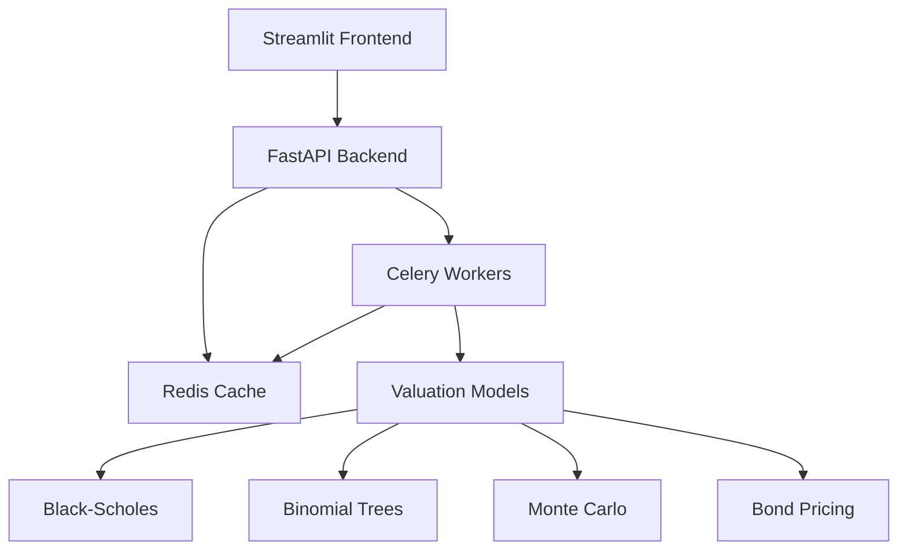

# Enhanced Valuation Engine with Streamlit, FastAPI, Celery & Terraform

🚀 **A comprehensive financial valuation platform with advanced pricing models, real-time computations, and interactive visualizations.**

## ✨ New Features (Enhanced Version)

### 🎯 **Advanced Valuation Models**

- **Black-Scholes Model**: European option pricing with full Greeks calculation
- **Binomial Tree Model**: American and European option pricing with configurable steps
- **Exotic Options**: Asian, Barrier, and Lookback options with Monte Carlo simulation
- **Bond Analytics**: Pricing, yield calculation, duration, and sensitivity analysis
- **Implied Volatility**: Calculation from market prices

### ⚡ **Optimized Computing**

- **Vectorized Monte Carlo**: NumPy-optimized simulations up to 10x faster
- **Numba JIT Compilation**: Just-in-time compilation for critical calculations
- **Redis Caching**: Intelligent caching of expensive computations
- **Async Task Processing**: Non-blocking background computations with Celery

### 📊 **Rich Interactive UI**

- **Multi-tab Interface**: Organized by asset class and complexity
- **Real-time Charts**: Interactive Plotly visualizations
- **Option Chains**: Dynamic option chain generation and analysis
- **Volatility Surfaces**: 3D volatility surface visualization
- **Portfolio Analytics**: Monte Carlo portfolio simulation with risk metrics
- **Progress Tracking**: Real-time task monitoring and status updates

### 🔧 **Enhanced API Endpoints**

- **Synchronous APIs**: Immediate results for fast calculations
- **Asynchronous APIs**: Background processing for heavy computations
- **Task Management**: Monitor, cancel, and track long-running tasks
- **Cache Management**: Cache statistics and control

## 🏗️ Architecture



## 🚀 Quick Start

### Prerequisites

- Python 3.8+
- Redis server
- Git

### Installation

```bash
# Clone the repository
git clone 
cd valuation_engine_with_celery_terraform

# Install dependencies
pip install -r requirements.txt

# Install Redis (if not already installed)
# macOS:
brew install redis

# Ubuntu/Debian:
sudo apt-get install redis-server

# Windows:
# Download and install from https://redis.io/download
```

### Easy Startup (Recommended)

```bash
# Start all services with one command
python start_services.py
```

This will automatically start:

- Redis server (port 6379)
- FastAPI backend (port 8000)
- Celery worker process
- Streamlit frontend (port 8501)

### Manual Startup

If you prefer to start services manually:

```bash
# Terminal 1: Start Redis
redis-server

# Terminal 2: Start FastAPI backend
uvicorn app.main:app --reload --port 8000

# Terminal 3: Start Celery worker
celery -A app.worker.celery_app worker --loglevel=info

# Terminal 4: Start Streamlit frontend
streamlit run streamlit_app.py
```

### Test the Installation

```bash
# Run comprehensive test suite
python test_enhanced_features.py
```

## 📚 API Documentation

Once the FastAPI server is running, visit:

- **Interactive API Docs**: <http://localhost:8000/docs>
- **API Schema**: <http://localhost:8000/redoc>

### Key Endpoints

#### Synchronous Pricing APIs

```http
POST /valuation/black-scholes     # Black-Scholes option pricing
POST /valuation/binomial-tree     # Binomial tree pricing
POST /valuation/exotic-options    # Exotic option pricing
POST /valuation/bond-pricing      # Bond valuation
POST /valuation/implied-volatility # IV calculation
GET  /valuation/option-chain      # Option chain generation
GET  /valuation/volatility-surface # Volatility surface
```

#### Asynchronous Task APIs

```http
POST /tasks/montecarlo            # Monte Carlo simulation
POST /tasks/black-scholes-async   # Async Black-Scholes
POST /tasks/portfolio-monte-carlo-async # Portfolio simulation
GET  /tasks/status/{task_id}      # Check task status
GET  /tasks/list-active           # List active tasks
```

## 🎨 User Interface Guide

### Tab 1: Basic Valuation

- Simple NPV calculator
- Cash flow analysis with visualization

### Tab 2: Options Pricing

- Black-Scholes, Binomial Tree, and Monte Carlo models
- Real-time Greeks calculation
- Option chain generation with interactive charts

### Tab 3: Exotic Options

- Asian options (arithmetic/geometric averaging)
- Barrier options (knock-in/knock-out)
- Lookback options (floating/fixed)

### Tab 4: Bond Analytics

- Bond pricing from yield or yield from price
- Duration and convexity analysis
- Yield sensitivity curves

### Tab 5: Portfolio Analysis

- Multi-asset portfolio simulation
- Risk metrics (VaR, CVaR, Sharpe ratio)
- Correlation matrix input
- Distribution analysis

### Tab 6: Market Data & Analytics

- Volatility surface generation
- Implied volatility calculation
- Task monitoring and management

## 🧪 Example Usage

### Black-Scholes Option Pricing

```python
import requests

# Price a call option
response = requests.post('http://localhost:8000/valuation/black-scholes', json={
    "S": 100,      # Current stock price
    "K": 105,      # Strike price
    "T": 0.25,     # 3 months to expiration
    "r": 0.05,     # 5% risk-free rate
    "sigma": 0.2,  # 20% volatility
    "option_type": "call"
})

result = response.json()
print(f"Call option price: ${result['option_price']:.4f}")
print(f"Delta: {result['greeks']['delta']:.4f}")
```

### Async Monte Carlo Simulation

```python
# Start Monte Carlo simulation
task_response = requests.post('http://localhost:8000/tasks/montecarlo', params={
    "trials": 100000,
    "S0": 100,
    "K": 100,
    "T": 1.0,
    "r": 0.05,
    "sigma": 0.2
})

task_id = task_response.json()['task_id']

# Check status
status_response = requests.get(f'http://localhost:8000/tasks/status/{task_id}')
result = status_response.json()

if result['status'] == 'completed':
    mc_result = result['result']
    print(f"Option price: ${mc_result['option_price']:.4f}")
    print(f"Standard error: {mc_result['std_error']:.6f}")
```

## 🔧 Configuration

### Redis Configuration

Update Redis connection in `app/utils/cache.py` and `app/worker.py`:

```python
# For remote Redis
redis_client = redis.Redis(host='your-redis-host', port=6379, db=0)
```

### Caching Settings

Adjust cache TTL in `app/worker.py`:

```python
@cached_computation("black_scholes", ttl=3600)  # Cache for 1 hour
```

### Performance Tuning

For heavy computations, adjust:

- Monte Carlo paths: Default 10,000 (increase for higher accuracy)
- Binomial tree steps: Default 100 (increase for American options)
- Cache TTL: Default 30-60 minutes

## 📈 Performance Benchmarks

### Monte Carlo Simulation (100,000 paths)

- **Original**: ~15 seconds
- **Enhanced**: ~2-3 seconds (5x faster)
- **With Caching**: ~0.1 seconds (cached results)

### Black-Scholes Calculation

- **Direct**: <1ms
- **With Greeks**: <2ms
- **Cached**: <0.1ms

## 🚀 Deployment

### Docker Deployment

```dockerfile
# Dockerfile example
FROM python:3.9-slim

WORKDIR /app
COPY requirements.txt .
RUN pip install -r requirements.txt

COPY . .

EXPOSE 8000 8501

# Start script would handle multiple services
CMD ["python", "start_services.py"]
```

### AWS ECS Deployment

The original Terraform scripts can be extended to include:

- Redis ElastiCache cluster
- Application Load Balancer
- Auto-scaling groups
- CloudWatch monitoring

## 🔍 Troubleshooting

### Common Issues

**Redis Connection Error**

```bash
# Check if Redis is running
redis-cli ping

# Should return: PONG
```

**Celery Worker Not Starting**

```bash
# Check if Redis is accessible
celery -A app.worker.celery_app inspect ping
```

**Import Errors**

```bash
# Ensure all dependencies are installed
pip install -r requirements.txt

# Check for missing system dependencies
python test_enhanced_features.py
```

**Slow Computations**

- Check if Numba is installed and working
- Verify Redis caching is enabled
- Monitor CPU usage during computations

### Performance Monitoring

```python
# Check cache statistics
import requests
stats = requests.get('http://localhost:8000/tasks/cache-stats').json()
print(f"Cache hit rate: {stats['hit_rate']:.2%}")
```

## 🤝 Contributing

1. Fork the repository
2. Create a feature branch: `git checkout -b feature/amazing-feature`
3. Commit changes: `git commit -m 'Add amazing feature'`
4. Push to branch: `git push origin feature/amazing-feature`
5. Open a Pull Request

### Development Setup

```bash
# Install development dependencies
pip install -r requirements.txt
pip install pytest black flake8

# Run tests
python test_enhanced_features.py

# Format code
black app/ streamlit_app.py

# Lint code
flake8 app/ streamlit_app.py
```

## 📄 License

This project is licensed under the MIT License - see the LICENSE file for details.

## 🙏 Acknowledgments

- **FastAPI**: High-performance async web framework
- **Streamlit**: Beautiful data apps framework
- **Celery**: Distributed task queue
- **Redis**: In-memory data structure store
- **NumPy/SciPy**: Scientific computing libraries
- **Plotly**: Interactive visualization library
- **Numba**: JIT compiler for Python

## 📞 Support

For questions and support:

- Create an issue on GitHub
- Check the troubleshooting section
- Review API documentation at `/docs`

---

⭐ **Star this repository if you find it useful!**
